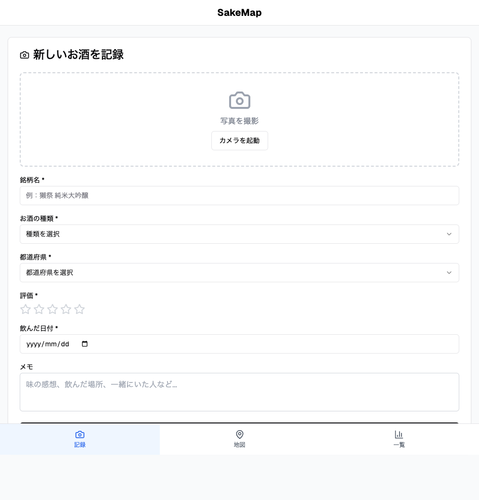
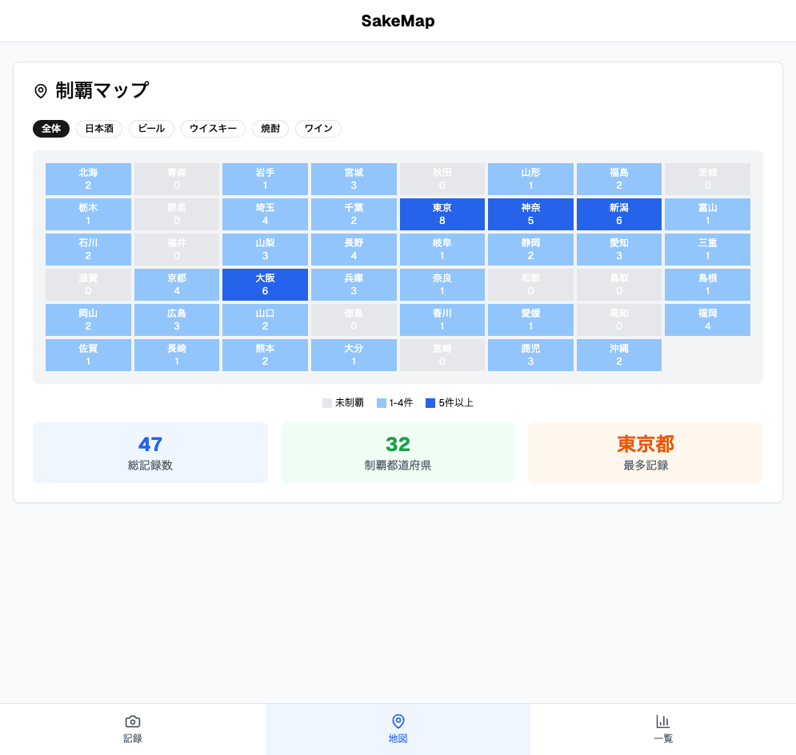
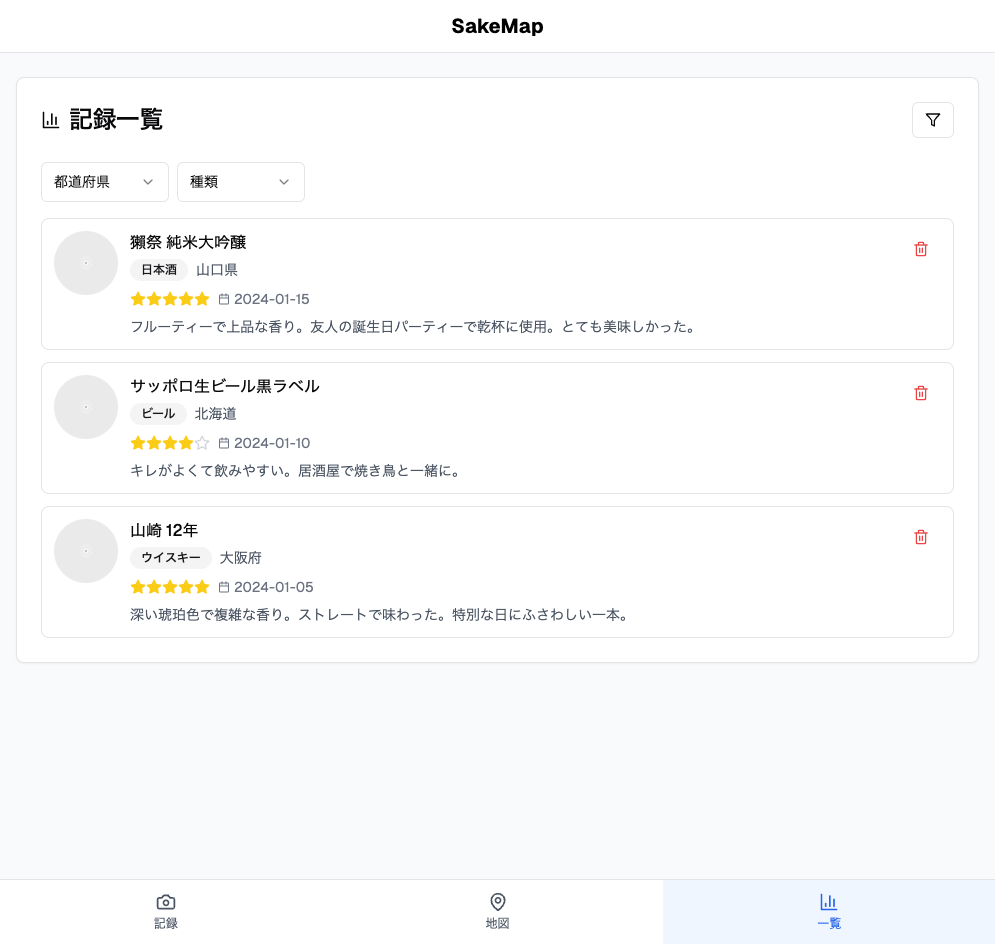

# お酒管理アプリ MVP仕様書

## 1. アプリ概要

### 1.1 アプリ名
**SakeMap**（仮称）

### 1.2 概要
飲んだお酒を記録し、地域別の制覇状況を可視化するAndroidアプリ

### 1.3 技術構成
- **開発言語**: Kotlin
- **UI**: Jetpack Compose
- **アーキテクチャ**: MVVM + Repository Pattern
- **データベース**: Room
- **画像保存**: 内部ストレージ
- **地図表示**: 自作SVG地図（軽量化のため）

## 2. データ設計

### 2.1 お酒記録エンティティ (DrinkRecord)
```kotlin
@Entity(tableName = "drink_records")
data class DrinkRecord(
    @PrimaryKey val id: String = UUID.randomUUID().toString(),
    val name: String,                    // 銘柄名
    val type: DrinkType,                // お酒の種類
    val prefecture: String,             // 都道府県
    val rating: Int,                    // 評価（1-5）
    val photoPath: String?,             // 写真パス
    val drinkDate: LocalDate,           // 飲んだ日付
    val createdAt: LocalDateTime = LocalDateTime.now()
)

enum class DrinkType {
    SAKE,      // 日本酒
    BEER,      // ビール
    WHISKEY,   // ウイスキー
    SHOCHU,    // 焼酎
    WINE       // ワイン
}
```

### 2.2 都道府県マスターデータ
```kotlin
data class Prefecture(
    val code: String,        // 01-47
    val name: String,        // 都道府県名
    val region: String       // 地方区分
)
```

## 3. 画面設計

### 3.1 メイン画面（BottomNavigation）
- **記録画面** (RecordScreen)
- **地図画面** (MapScreen)
- **一覧画面** (ListScreen)

### 3.2 記録画面 (RecordScreen)
#### 機能
新しいお酒の記録を追加

#### UI構成
```
[写真撮影エリア]
├ カメラボタン
└ 撮影済み画像表示

[入力フォーム]
├ 銘柄名入力 (TextField)
├ お酒の種類選択 (DropdownMenu)
├ 都道府県選択 (DropdownMenu) 
├ 評価選択 (5つ星)
├ 飲んだ日付 (DatePicker)
└ 保存ボタン
```

### UIイメージ



#### バリデーション
- 銘柄名: 必須、1文字以上50文字以内
- お酒の種類: 必須選択
- 都道府県: 必須選択
- 評価: 必須、1-5の範囲
- 日付: 必須、過去日付のみ

### 3.3 地図画面 (MapScreen)
#### 機能
都道府県別の制覇状況を地図で表示

#### UI構成
```
[フィルター]
├ 全体表示
└ お酒種類別フィルター (タブ)

[日本地図]
├ SVG形式の都道府県地図
├ 色分け表示（3段階）
│  ├ グレー: 未制覇 (0件)
│  ├ 薄い青: 少し制覇 (1-4件)
│  └ 濃い青: たくさん制覇 (5件以上)
└ タップで詳細情報表示

[統計情報]
├ 総記録数
├ 制覇都道府県数
└ 最も多い都道府県
```

### UIイメージ



#### インタラクション
- 都道府県タップ → その県の記録一覧をダイアログ表示
- 色の段階は記録数に応じて自動更新

### 3.4 一覧画面 (ListScreen)
#### 機能
記録したお酒の一覧表示・管理

#### UI構成
```
[フィルター・ソート]
├ 都道府県フィルター
├ お酒種類フィルター
├ 評価フィルター
└ ソート（日付順・評価順・名前順）

[リスト表示]
├ LazyColumn
└ 各アイテム:
   ├ 写真（サムネイル）
   ├ 銘柄名
   ├ 種類・都道府県
   ├ 評価（星表示）
   ├ 飲んだ日付
   └ 削除ボタン
```

### UIイメージ



## 4. 技術仕様

### 4.1 アーキテクチャ構成
```
UI Layer (Composable)
    ↓
ViewModel
    ↓
Repository
    ↓
Room Database + File Storage
```

### 4.2 主要コンポーネント

#### DrinkRepository
```kotlin
interface DrinkRepository {
    suspend fun insertDrink(drink: DrinkRecord)
    suspend fun getAllDrinks(): Flow<List<DrinkRecord>>
    suspend fun getDrinksByPrefecture(prefecture: String): Flow<List<DrinkRecord>>
    suspend fun getDrinksByType(type: DrinkType): Flow<List<DrinkRecord>>
    suspend fun deleteDrink(id: String)
    suspend fun getPrefectureStats(): Flow<Map<String, Int>>
}
```

#### PhotoManager
```kotlin
class PhotoManager {
    suspend fun savePhoto(bitmap: Bitmap): String  // 保存してパスを返す
    suspend fun loadPhoto(path: String): Bitmap?
    suspend fun deletePhoto(path: String)
}
```

### 4.3 データベース設計
```kotlin
@Database(
    entities = [DrinkRecord::class],
    version = 1,
    exportSchema = false
)
abstract class DrinkDatabase : RoomDatabase() {
    abstract fun drinkDao(): DrinkDao
}

@Dao
interface DrinkDao {
    @Query("SELECT * FROM drink_records ORDER BY drinkDate DESC")
    fun getAllDrinks(): Flow<List<DrinkRecord>>
    
    @Query("SELECT prefecture, COUNT(*) as count FROM drink_records GROUP BY prefecture")
    fun getPrefectureStats(): Flow<Map<String, Int>>
    
    @Insert
    suspend fun insert(drink: DrinkRecord)
    
    @Delete
    suspend fun delete(drink: DrinkRecord)
}
```

## 5. 画面遷移

### 5.1 基本フロー
```
起動
 ↓
メイン画面（地図表示）
 ├ 記録画面 → 記録完了 → 地図画面
 ├ 地図画面 → 都道府県タップ → 詳細ダイアログ
 └ 一覧画面 → アイテムタップ → 詳細表示
```

## 6. 非機能要件

### 6.1 パフォーマンス
- 起動時間: 3秒以内
- 地図描画: 1秒以内
- データ読み込み: 2秒以内（1000件まで）

### 6.2 ストレージ
- 写真1枚あたり最大2MB
- アプリ全体で最大500MB使用想定

### 6.3 対応端末
- Android 7.0 (API 24) 以上
- RAM 2GB以上推奨

## 7. 開発フェーズ

### Phase 1: データ層構築
- Room データベース設定
- Repository実装
- 基本的なCRUD操作

### Phase 2: 記録機能
- 記録画面UI
- カメラ機能
- バリデーション

### Phase 3: 表示機能
- 一覧画面
- フィルター・ソート機能

### Phase 4: 地図機能
- SVG地図表示
- 色分け機能
- タップ操作

### Phase 5: 統合テスト・最適化
- 全体動作確認
- パフォーマンス調整
- UI/UX改善

## 8. 今後の拡張予定
- レア度システム
- ソーシャル機能
- 詳細統計機能
- データエクスポート機能
- バックアップ・復元機能